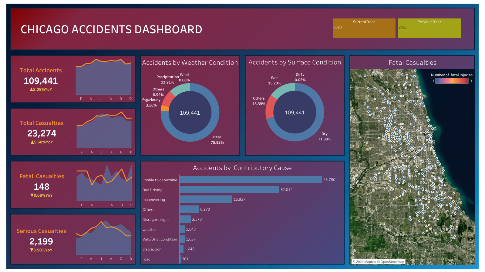

# Chicago-Crashes-Viz
This project aims to explore the car accidents occurred in Chicago over the past 3 years to understand the underlying factors contributing to these incidents. It examines the number of accidents each year, categorized by weather conditions, surface conditions, and contributory causes, as well as the severity of the casualties.

The project is divided into two parts:
- Data cleaning: [Excel Workbook](https://github.com/maurodv09/Chicago-Crashes-Viz/blob/main/crashes_chicago.xlsx).
- Data visualiztion: [Tableau Workbook](https://github.com/maurodv09/Chicago-Crashes-Viz/blob/main/Road%20Accidents.twbx).

*The data cleaning process was conducted using PowerQuery. Detailed documentacion of the steps taken can be found in the [data-cleaning-documentation](https://github.com/maurodv09/Chicago-Crashes-Viz/blob/main/data-cleaning-documentation.md) file.

## Results
Dashboard snapshot

The dashboard can be found [here](https://public.tableau.com/app/profile/mauro.del.valle/viz/RoadAccidents_17281488647540/Dashboard1).

## Dataset
The data was obteinded from [The U.S. Government's Open Data](https://catalog.data.gov/dataset/traffic-crashes-crashes).

the file was previously divided in a csv file for each year and stored in the /dataset/data folder, relative to the Excel workbook. The folder structure is necessary to run the excel query correctly.

## Tools
- Microsoft Excel
- Tableau Public
